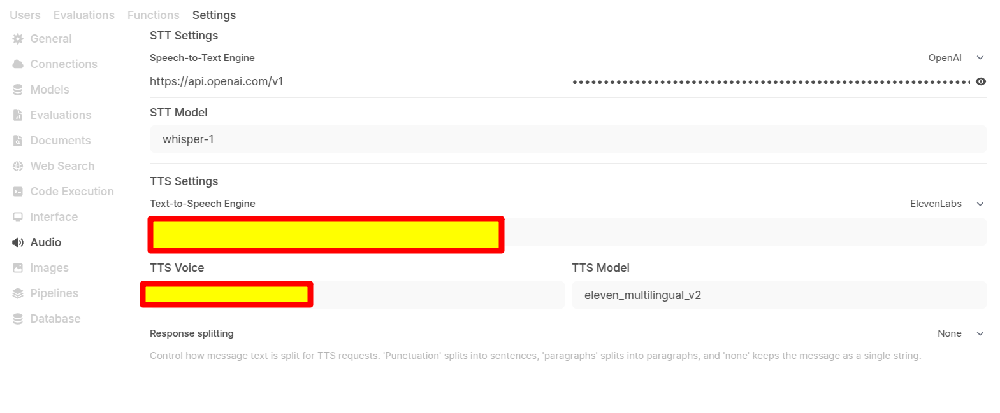
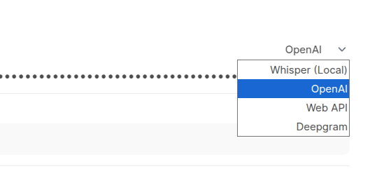
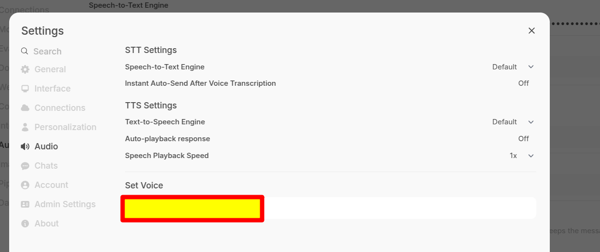

Open Web UI supports both local, browser, and remote speech to text.

## Cloud / Remote Speech To Text Proivders

The following cloud speech to text providers are currently supported. API keys can be configured as environment variables (OpenAI) or in the admin settings page (both keys).

 | Service  | API Key Required |
 | ------------- | ------------- |
 | OpenAI  | ✅ |
 | DeepGram  | ✅ |

 WebAPI provides STT via the built-in browser STT provider.

## Configuring Your STT Provider

To configure a speech to text provider:

- Navigate to the admin settings  
- Choose Audio
- Provider an API key and choose a model from the dropdown  

## User-Level Settings

In addition the instance settings provisioned in the admin panel, there are also a couple of user-level settings that can provide additional functionality.

*   **STT Settings:** Contains settings related to Speech-to-Text functionality.
*   **Speech-to-Text Engine:** Determines the engine used for speech recognition (Default or Web API).
 

## Using STT

Speech to text provides a highly efficient way of "writing" prompts using your voice and it performs robustly from both desktop and mobile devices.

To use STT, simply click on the microphone icon:

A live audio waveform will indicate successful voice capture:

## STT Mode Operation

Once your recording has begun you can:

- Click on the tick icon to save the recording (if auto send after completion is enabled it will send for completion; otherwise you can manually send)
- If you wish to abort the recording (for example, you wish to start a fresh recording) you can click on the 'x' icon to scape the recording interface

